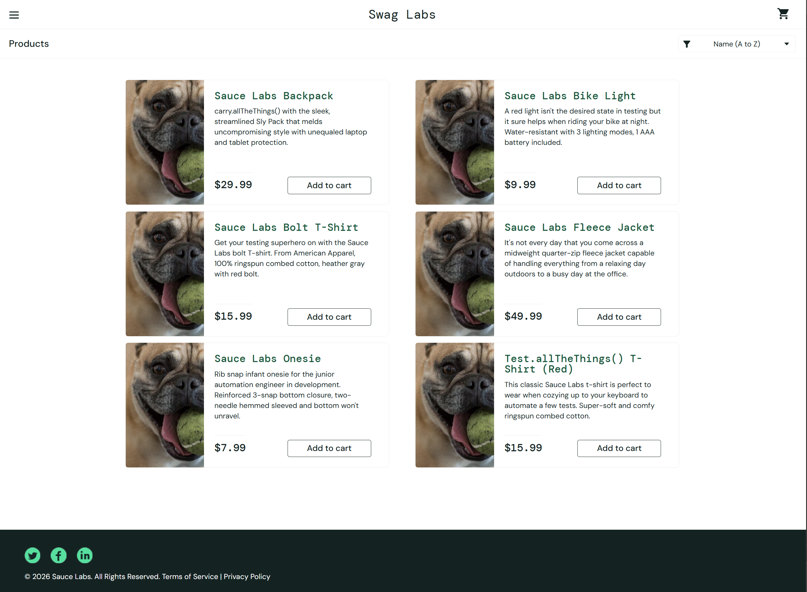
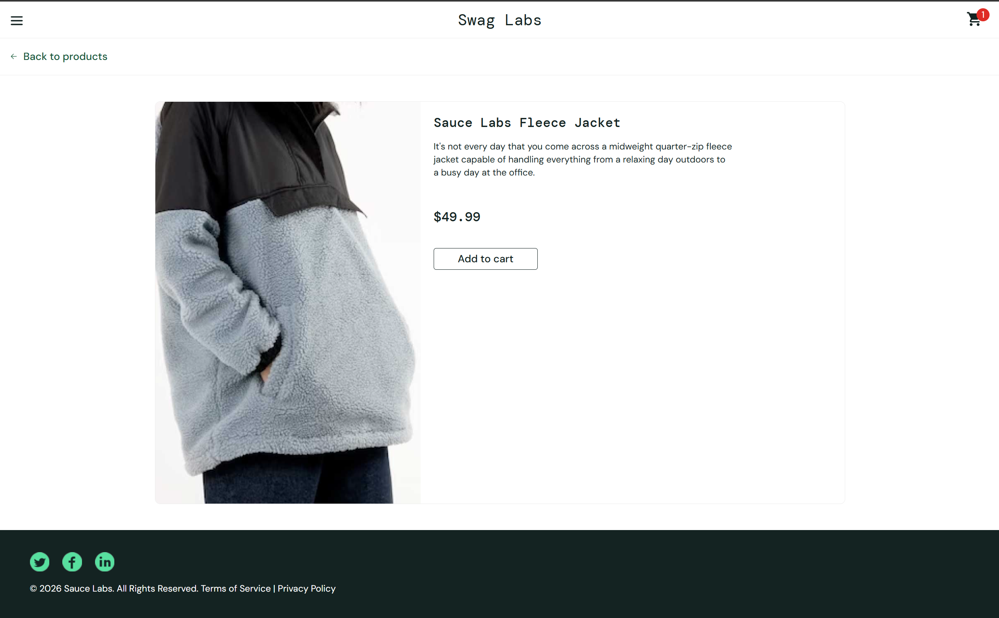

# Defect Report: BUG-01

## Summary

All product images on the inventory page are incorrect for `problem_user`. The inventory page shows the same dog image for every product. The correct product image is only visible on the individual product detail page.

---

## Details

| Field             | Detail                        |
|-------------------|-------------------------------|
| ID                | BUG-01                        |
| Reported By       | [Your Name]                   |
| Date              | [Date]                        |
| Environment       | https://www.saucedemo.com     |
| Browser           | Chrome (latest)               |
| Severity          | Medium                        |
| Priority          | Medium                        |
| Status            | Open                          |
| Found During      | Exploratory session EX-01     |

---

## Preconditions

- User is logged in as `problem_user` with password `secret_sauce`

---

## Steps to Reproduce

1. Go to https://www.saucedemo.com
2. Log in with username `problem_user` and password `secret_sauce`
3. On the inventory page, observe the images shown for all products
4. Click on any product to go to the product detail page
5. Observe the image on the product detail page

---

## Expected Result

Each product on the inventory page shows its own correct image.

## Actual Result

All products on the inventory page show the same dog/pug image. The correct product image only appears on the individual product detail page.

---

## Root Cause Analysis

Not yet investigated. Likely a data mapping issue between the inventory view and the cart view for the `problem_user` account. The `problem_user` account is known to have pre-configured bugs on this demo site, which makes this a useful account for exploratory testing.

---

## Attachments

---

## Notes

This defect was found during exploratory session EX-01, outside the scripted test cases. It would not have been caught by the automated suite in its current form. A new test case targeting image consistency could be added to prevent regression.